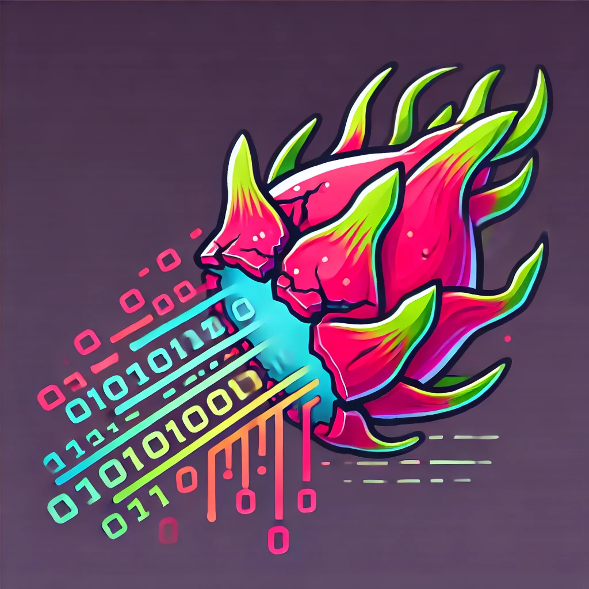

# DragonCrack

## Principle
DragonCrack is a DES cracker implemented on RedPitaya boards, embedding Zynq-7 SOCs.

The goal is to implement workers on FPGA and communications are handled by the processor.

Communication with host computer is done through Ethernet. On computer's side, a Python driver manages boards (named 
modules later on).

In Vivado project, a dummy [top.vhd](project_FPGA/DragonCrackFPGA.srcs/sources_1/new/top.vhd) file embeds the block
design. This block design contains the Zynq Processing System (processor), the DESCracker IP, the XADC IP and some
useful blocks (to manage buses, clocks, etc.).

- DESCracker IP contains the workers that do the bruteforce. Source code is in 
[ip_repo/DEScracker_IP_1_0/hdl](ip_repo/DEScracker_IP_1_0/hdl). It communicates through AXI, using a registers model.
- XADC is configured so that SOC temperature can be monitored. By this way, in case of overheat, the workers can be 
stopped.

A worker encrypts the given plaintext with a key then compares the ciphertext against two reference ciphertexts. If the
ciphertext matches one of the two references, specific action is done to store the result (it depends on versions). The
reason why two references are used is explained in the next section.

Also, a mask is applied to the computed ciphertext before the comparison. Then, comparisons are done as follows: 
`ciphertext & mask == reference`. Each reference has its own mask. This mask mechanism lets the user exhaust keys when
only some bits of ciphertext are known.

### Bruteforce optimisation
Let `C = DES(M, K)` with known C and M.

Then `#C = DES(#M, #K)`, where `#` is the NOT operator.

Then, if `DES(#M, K) = C'`, `DES(##M, #K) = DES(M, #K) = #C'`

Thus, before bruteforcing we:
- choose `M`
- compute `C`
- compute `C'`
- compute `#C'`
- set references to `C` and `#C'`

This doubles our chance to find the correct key as `K` and `#K` are searched at the same time.

## Versions
Here are basic explanations on all versions of DragonCrack. See [doc/versions.md](doc/versions.md) for more details.

### Benchmarks
Benchmarks are done on a single module.

When no match is found:

| Version |   Keys/s    | Time to exhaust 2^56 keys | Perf against previous |
|:-------:|:-----------:|:-------------------------:|:---------------------:|
|   V0    |  7_968_851  |   286y 267d 11h 28m 52s   |                       |
|   V1    | 552_112_619 |    4y 50d 13h 28m 12s     |        6928 %         |

When all keys match:

| Version | Keys/s | Time to exhaust 2^56 keys  | Perf against previous |
|:-------:|:------:|:--------------------------:|:---------------------:|
|   V0    |   84   | 27110784y 270d 10h 21m 27s |                       |
|   V1    |  211   | 10784658y 190d 13h 33m 19s |         251 %         |

### V0 - Proof of concept
A single DES worker is implemented, using a very slow clock. Implementation is as naive as possible (even dumb on 
certain aspects). 

### V1 - First real design ()
28 workers are implemented with a 20 MHz clock. Implementation of DES is the same as V0.

## Requirements
- Python >=3.12
- Vivado 2022.2
- Vitis 2022.2

## How to get started
- clone this repo
- open [project_FPGA/DragonCrackFPGA.xpr](project_FPGA/DragonCrackFPGA.xpr) in Vivado
- create block design wrapper
  - right-click on "[main_bd.bd](project_FPGA/DragonCrackFPGA.srcs/sources_1/bd/main_bd/main_bd.bd)"
  - create HDL wrapper (use default parameters)
  - Refresh hierarchy
- generate bitstream
- export hardware (include bitstream, leave other parameters as default)
- launch Vitis
- choose [project_vitis/workspace](project_vitis/workspace) as workspace
- close "Welcome" page and open XSCT console ("Xilinx" menu)
- in console
  - `cd [path to this repo]`
  - `source generateVitisProject.tcl`
- compile platform and application