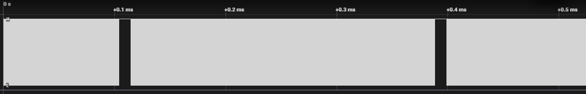
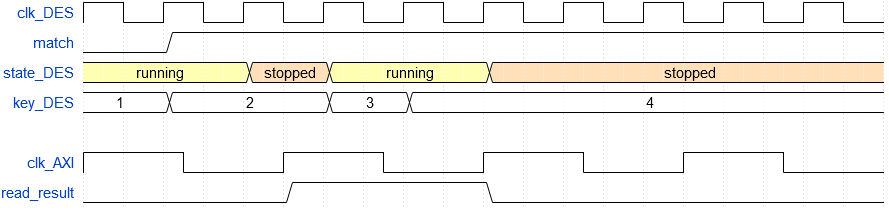

# Notes on versions of DragonCrack

## V0 - Proof of concept

Based on DEScracker IP v1.0.

A single DES worker is implemented. Implementation is as naive as possible (even dumb on certain aspects).

Most important facts about the IP:
- Plaintext, 2 references and 2 masks are defined globally.
- It groups multiple parallel workers. Each worker is independent and have its own start key and end key. It exhausts 
all keys between them one by one.
- Each worker relies on its own registers to set parameters (start/end key, etc.) and output results. 505 registers are
defined in the AXI registers model. It takes a lot of resources but this version is meant to be naive.
- Workers work using the same clock as the one used for AXI bus. It is set to 8MHz in this version to avoid timing 
problems.
- When a worker finds a result that matches the reference and the mask, it is stopped until the result is read. The 
result consists in the 56-bit key and a bit that indicates against which reference it matches.
- In workers, DES is done in 1 clock cycle: all combinational, no pipeline
- Python driver polls continuously result registers to get pending results.
- In Vivado, default synthesis and implementation are used.
- In Vitis, the program just execute simple commands received from Python driver. Commands just consist in reading or
writing a single register.

Notes on resources usage (after implementation) of IP:

| Block  | Number of LUTs | Number of FlipFlops |
|:------:|:--------------:|:-------------------:|
| Total  |      8116      |        16550        |
|  AXI   |      6582      |        16375        |
| worker |      961       |         175         |

## V1 - First real implementation

The goal is to set the working frequency of workers at its maximum value with no negative slack and also to instantiate
as many workers as possible. Indeed, when usage of FPGA resources will rise, timing will be harder to maintain.

First results:

| Working frequency (MHz) | Number of workers | Theoretical keys/s | Worst negative slack (ns) |   LUT usage   |   FF usage    |
|:-----------------------:|:-----------------:|:------------------:|:-------------------------:|:-------------:|:-------------:|
|           25            |         3         |        75 M        |           1.064           | 23.9% (12721) | 16.7% (17819) |
|           20            |        28         |       560 M        |           1.43            | 96.7% (51482) | 20.9% (22192) |

By doing some tests, it appeared that on a single worker, the maximum frequency is around 27 MHz. With 28 workers,
frequency could probably be optimised but compilation take 30 min and I did not have enough patience to do multiple
compilations.

**Note:** for some reason, a bug in IP customisation tool blocked the setting of FCLK_CLKx frequency... From now on, 
advanced setting ("override clocks" mode) is used.

Notes on resources usage (after implementation) of IP:

| Block  |    Number of LUTs     | Number of FlipFlops |
|:------:|:---------------------:|:-------------------:|
| Total  |         50802         |        21283        |
|  AXI   |         6879          |        16393        |
| worker | between 1300 and 2300 |         175         |

In this configuration, each worker is implemented using a different number of LUTs.

## V2 - Fully pipelined

In V1, combinational DES implied a very long critical path, limiting the maximum working frequency. In this version, 
DES are completely pipelined (17 stages) to get rid of path problems. Also, in terms of resources, it uses FFs that
were left free in V1.

Same strategy as for V1 is used to maximise keys/s. Leading to this result:

| Working frequency (MHz) | Number of workers | Theoretical keys/s | Worst negative slack (ns) |   LUT usage   |   FF usage    |
|:-----------------------:|:-----------------:|:------------------:|:-------------------------:|:-------------:|:-------------:|
|          41.7           |        21         |      875.7 M       |           2.353           | 85.7% (45568) | 59.1% (62915) |

Notes on resources usage (after implementation) of IP:

| Block  |    Number of LUTs     | Number of FlipFlops |
|:------:|:---------------------:|:-------------------:|
| Total  |         44888         |        62006        |
|  AXI   |         6596          |        16394        |
| worker | between 1605 and 2456 |        2172         |

In this configuration, each worker is implemented using a different number of LUTs.

## V3 - Separated clock for DES

In previous versions, AXI clock is also used as DES workers' clock. By doing a record with a logic analyser on it (next 
figure), it can be observed that this clock is gated. It implies a drop of performance. This can explain why real 
performance is always lower than the theoretical one.

In V2, critical path is not DES anymore. It is situated in AXI peripheral of DES IP. There are two solutions to solve
this problem:
- optimise the AXI peripheral
- create a dedicated clock for DES workers

First, a dedicated clock is created in this version. AXI peripheral will be optimised in further versions.

| Working frequency (MHz) | Number of workers | Theoretical keys/s | Worst negative slack (ns) |   LUT usage   |   FF usage    |
|:-----------------------:|:-----------------:|:------------------:|:-------------------------:|:-------------:|:-------------:|
|           100           |        21         |       2.1 G        |           0.561           | 85.3% (45390) | 59.1% (62921) |

Usage is almost the same as V2.

Now that AXI clock and DES clocks are separated, the signal `read_result` must be adapted. Indeed, it is clocked by AXI 
but works with DES state machine. As shown in next figure, if code is kept as in V3, key number 3 would be skipped.
(Figure has been generated on [https://wavedrom.com](https://wavedrom.com))

To avoid this, the DES worker state machine has been changed so that it waits for `read_result = 0` to resume the
bruteforce. It is slow because each result needs to be read separately (they cannot be read on-the-fly). Considering
that the number of matches would be low, it is not a big lack of performance.

AXI frequency is lowered to 40 MHz. When it is set higher, the design is unstable. This issue will be addressed when AXI 
peripheral will be optimised.

## V4 - Simplified AXI

AXI is simplified so that it takes less resources. See 
[../ip_repo/DEScracker_IP_4_0/doc/ProductGuide.md](../ip_repo/DEScracker_IP_4_0/doc/ProductGuide.md) for more details.
The current key is not readable as it is not useful and as it is more time-consuming to read all current keys (change
current worker in "WORKER" register and then read the key).

Also, the number of workers is now limited to 32. If this limit would be reached, tests would be done to determine the 
best strategy to instantiate more workers:
- instantiate another IP
- modify the IP to extend the limit to 64 workers

AXI resources are divided by 4! (See resource usage below)

Thanks to gained resources, 29 workers are now implemented. Their clock is still 100 MHz as DES is still the critical
path.

| Working frequency (MHz) | Number of workers | Theoretical keys/s | Worst negative slack (ns) |   LUT usage   |   FF usage    |
|:-----------------------:|:-----------------:|:------------------:|:-------------------------:|:-------------:|:-------------:|
|           100           |        29         |       2.9 G        |           0.703           | 93.0% (49471) | 63.6% (67711) |

Notes on resources usage (after implementation) of IP:

| Block  |    Number of LUTs     | Number of FlipFlops |
|:------:|:---------------------:|:-------------------:|
| Total  |         48794         |        66813        |
|  AXI   |         1669          |        3738         |
| worker | between 1616 and 1729 |        2175         |

In this configuration, each worker is implemented using a different number of LUTs.

## V5 - Fix part of the key

Key is now split in 2 parts:
- fixed part (MSBs) which is constant
- variable part (LSBs) which is exhausted

The user sets the fixed bits of the key and then launches the exhaust. It is done on variable bits only, from 0x00... to
0xFF...

The variable part is here set to 32 bits. Driver has been modified to be able to work with chunks of 2^32 elements. By 
doing this, the counter that increments key to be tested is smaller. Used resources are then reduced and design can be 
faster. Clock is now at 200 MHz. 29 workers are implemented. A 30th could be added but clock could not reach 200 MHz.

Finally, configuration is:

| Working frequency (MHz) | Number of workers | Theoretical keys/s | Worst negative slack (ns) |   LUT usage   |   FF usage    |
|:-----------------------:|:-----------------:|:------------------:|:-------------------------:|:-------------:|:-------------:|
|           200           |        29         |       5.8 G        |           0.001           | 89.8% (47774) | 50.1% (53277) |

Note the difference between theoretical throughput and real one (see [README.md](../README.md)). It is due to the fact
that workers have to be handled one by one and it is done using Python, through Ethernet and C driver. 

Notes on resources usage (after implementation) of IP:

| Block  |    Number of LUTs     | Number of FlipFlops |
|:------:|:---------------------:|:-------------------:|
| Total  |         47774         |        53277        |
|  AXI   |          475          |        1165         |
| worker | between 1583 and 1700 |        1766         |

In this configuration, each worker is implemented using a different number of LUTs. As AXI did not change a lot, the 
difference of resources usage against V4 is unexplained.